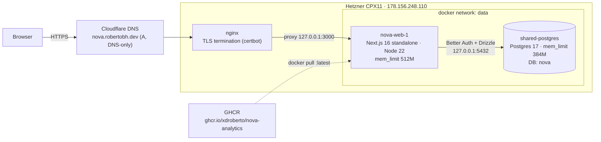
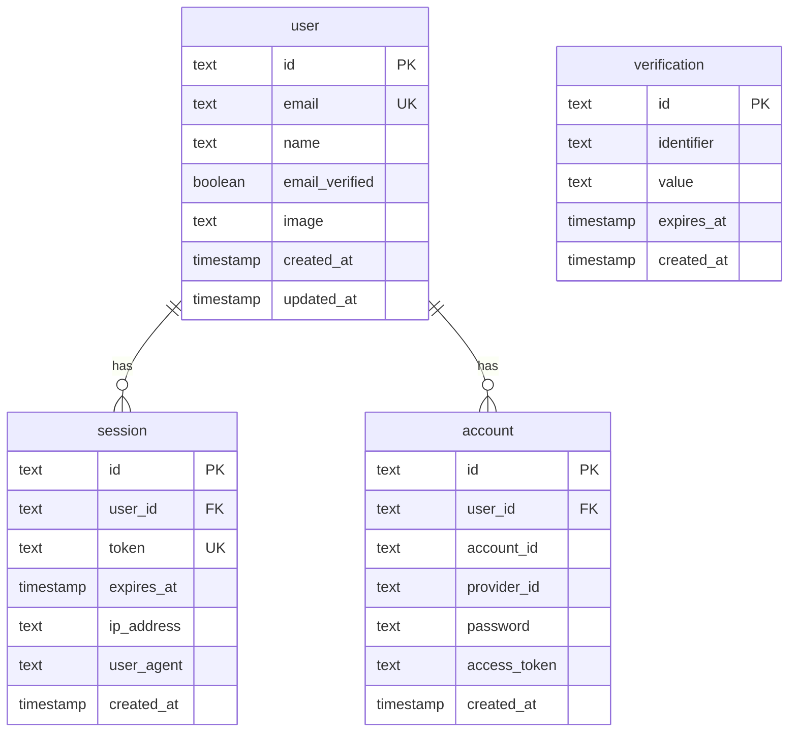
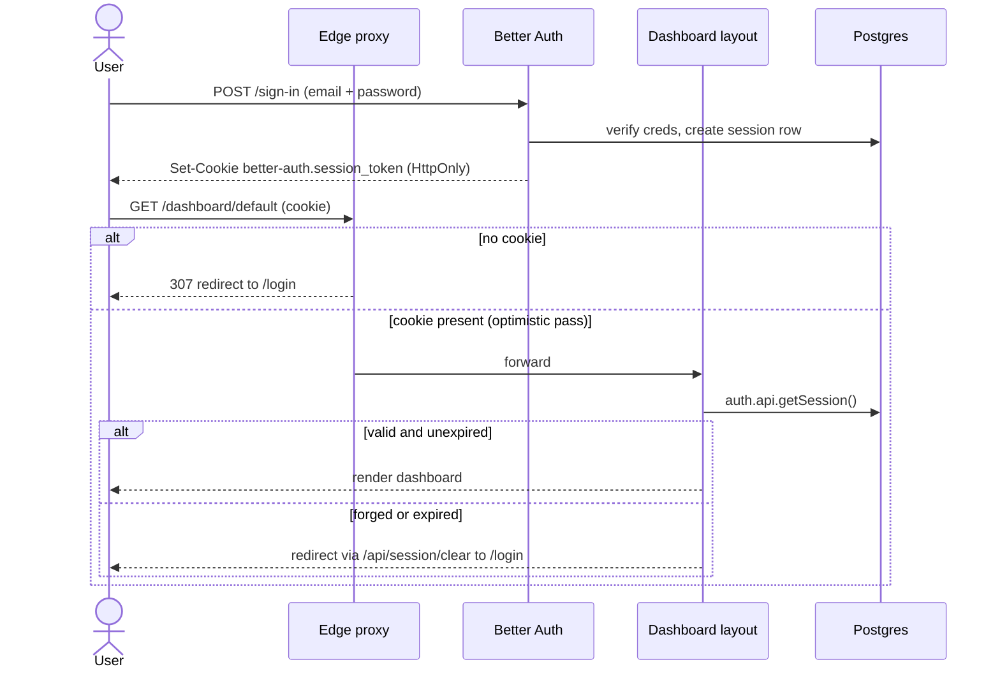
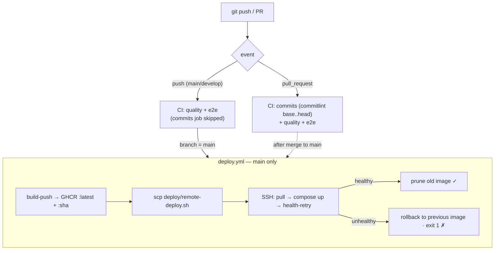
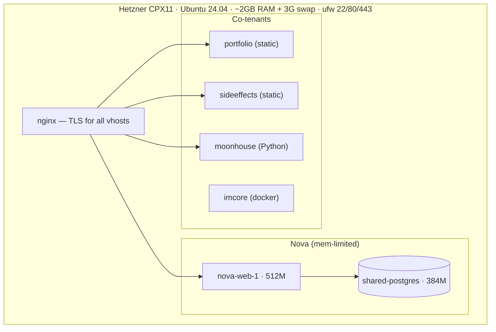
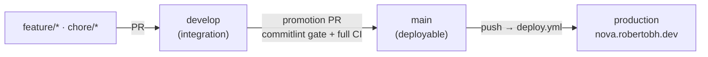

# Nova Analytics — Architecture

Six diagrams of the running system. GitHub renders ` ```mermaid ` fences natively.
Each is generated from the real repo (`src/db/auth-schema.ts`, `src/proxy.ts`,
`.github/workflows/`, `deploy/`, `docs/deployment.md`) — not idealized.

## 1. System architecture

Request path (browser → TLS → app → DB) plus the CI-built image supply.



> Security headers (HSTS, X-Frame-Options DENY, nosniff, Referrer-Policy, Permissions-Policy)
> are set app-side in `next.config.mjs`, so they hold even without nginx.

## 2. Database ERD

Better Auth schema (`src/db/auth-schema.ts`). `verification` is standalone; `session`
and `account` cascade-delete with their `user`.



## 3. Auth flow (two-layer session check)

The edge proxy is optimistic (cookie presence only); the dashboard layout does the
authoritative `getSession()` against the DB.



## 4. CI/CD pipeline

`.github/workflows/ci.yml` gates every change; `deploy.yml` ships on `main`.



> `quality` = lint + `tsc` + `test:unit` + branding gate + `next build`.
> `e2e` = Postgres service + `drizzle-kit push` + Playwright (incl. the security bypass suite).

## 5. VPS topology (shared host, isolated Nova)

One CPX11 hosts Nova alongside co-tenants; isolation is by container memory limits + swap
(ADR-003 amendment). `ufw` allows only 22/80/443.



## 6. Branching & promotion model

`main` is deployable; `develop` integrates; `feature/*` (and `chore/*`) branch off develop.
A promotion PR to `main` runs the full CI incl. the commitlint gate, then merging deploys.


